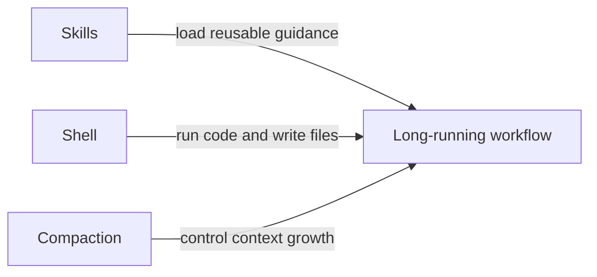

# Sample Output (EN)

## Visual strategy summary

- This article needs a light-to-medium visual density because it is long, conceptual, and aimed at technical readers.
- Prioritize credibility over decoration: screenshots are more valuable than abstract art in the most important sections.
- Use one structural diagram for the “Skills + Shell + Compaction” relationship because that section explains interaction, not a specific UI.
- Reserve the cover image for theme and recognition; do not let it replace explanatory visuals in the body.
- It is acceptable to leave some summary paragraphs without images.

## Visual plan table

| slot | section | goal | reader_job | visual_class | production_mode | author_action | priority | why_here | production_path | optional |
| --- | --- | --- | --- | --- | --- | --- | --- | --- | --- | --- |
| 1 | Plan mode | reduce novelty cost | recognize what the interface looks like | Author-captured evidence | manual screenshot | open Plan mode and capture the round where Codex asks clarifying questions | high | readers likely have never seen this feature | screenshot, then light annotation if needed | no |
| 2 | AGENTS.md | lower abstraction | understand that this is a real file with reusable rules | Author-captured evidence | manual screenshot | capture a real `AGENTS.md` file or `/init` generated starter | high | this is one of the article's core concepts | screenshot with optional blur/redaction | no |
| 3 | Skills + Shell + Compaction | explain relationship | grasp how three capabilities work together | Diagram-first | assistant-generated diagram | review and lightly edit labels | high | the section is relational and benefits from a compact systems view | Mermaid or flow diagram | no |
| 4 | Code review | increase trust | believe that Codex can review real PRs | Author-captured evidence | manual screenshot | capture a real `/review` result with one visible concrete comment | medium | screenshot is more persuasive than paraphrase | screenshot with optional callout | yes |
| 5 | Operations / MCP logs | make abstract workflow concrete | imagine the “one prompt -> logs + code + git” workflow | Author-captured evidence | manual screenshot | capture MCP settings or a troubleshooting conversation | medium | readers need a concrete anchor here | screenshot, optionally paired with annotation | yes |
| 6 | Article cover | establish theme | recognize article topic at a glance | Cover image | external image model or manual design | generate from brief or build in a design tool | medium | useful for Juejin distribution, but not a substitute for body visuals | cover brief or prompt | yes |

## Detailed briefs

### 1. Plan mode

- Capture target: Codex in Plan mode with the question-asking round visible
- Navigation path: open Codex app or CLI, switch with `/plan` or `Shift+Tab`
- Required state: one message where Codex is clarifying scope before implementation
- Crop focus: mode indicator, assistant question, and surrounding context
- What to redact: private repo names, secrets, unrelated task text
- Annotation idea: one subtle callout on the mode switch or the clarifying question

### 2. AGENTS.md

- Capture target: a real `AGENTS.md` file or `/init` starter output
- Required state: show enough lines to make the purpose obvious
- Crop focus: title plus several rule bullets or command examples
- What to redact: internal project names, private commands, credentials, URLs
- Why not a generated image: authenticity matters more than polish

### 3. Skills + Shell + Compaction

- Diagram type: relationship diagram
- Core message: Skills define reusable workflow knowledge, Shell executes work, Compaction keeps long tasks alive
- Required nodes: Skills, Shell, Compaction, Long-running workflow
- Suggested labels:
  - Skills -> Long-running workflow: "load reusable guidance"
  - Shell -> Long-running workflow: "run code and write files"
  - Compaction -> Long-running workflow: "control context growth"
- Optional Mermaid starter:

### 4. Code review

- Capture target: one real Codex review result with a meaningful comment
- Required state: comment text must be readable enough to prove specificity
- Crop focus: changed file context plus review comment
- Enhancement option: add a box around the exact review finding
- Fallback: if a full PR is unavailable, use a local review run against uncommitted changes

### 5. Operations / MCP logs

- Capture target: MCP server settings page or a real troubleshooting thread
- Required state: show enough to make the external-tool connection obvious
- Crop focus: either the connected tools list or the prompt/result pair
- Annotation idea: add a small arrow sequence showing logs -> code -> git
- Fallback: if production logs cannot be shown, use a mocked safe example with the same workflow shape

### 6. Article cover

- Article topic: practical lessons from three official Codex guides
- Target audience: engineers and technical creators
- Visual metaphor: an AI teammate desk or coordinated engineering workflow
- Mood: capable, clear, modern, not sci-fi fantasy
- Composition: leave clean title-safe space, avoid clutter, keep subject centered
- Color direction: calm blue / neutral tech tones
- Avoid: robots, neon cyberpunk overload, fake code text, crowded UI collage

## Editorial notes

- Do not add a visual to the intro or conclusion unless the platform strongly benefits from a cover image.
- If only three visuals can be produced, keep: Plan mode, AGENTS.md, and Skills + Shell + Compaction.
- For Juejin, prioritize legibility on a narrow article column and avoid tiny text inside diagrams.
- Use screenshot enhancement sparingly; most screenshots should remain clean and believable.
