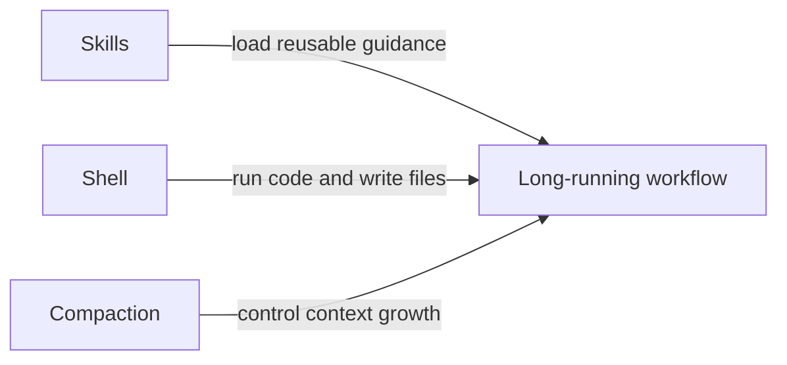

# 示例输出（中文）

## 配图策略摘要

- 这篇文章适合“轻到中等密度”的配图，因为它篇幅较长、概念较多，但读者是技术人，不需要过度装饰。
- 优先保证可信度而不是装饰感：关键位置应优先使用真实截图，而不是抽象概念图。
- “Skills + Shell + Compaction” 这段更适合结构解释图，因为它要讲的是三者关系，而不是某个具体界面。
- 题图只承担主题识别和传播入口，不应该替代正文里的解释型配图。
- 一些总结或收束段落可以明确不配图，保持阅读节奏。

## 配图建议表

| slot | section | goal | reader_job | visual_class | production_mode | author_action | priority | why_here | production_path | optional |
| --- | --- | --- | --- | --- | --- | --- | --- | --- | --- | --- |
| 1 | Plan 模式 | 降低陌生感 | 让读者快速知道这个界面长什么样 | Author-captured evidence | 手动截图 | 打开 Plan 模式，截 Codex 向你追问需求的那一轮 | high | 很多读者从未见过这个功能 | 截图，必要时轻度标注 | no |
| 2 | AGENTS.md | 降低抽象度 | 让读者理解这是真实存在、可复用的规则文件 | Author-captured evidence | 手动截图 | 截真实 `AGENTS.md` 文件或 `/init` 生成结果 | high | 这是全文最核心的概念之一 | 截图，可选打码 | no |
| 3 | Skills + Shell + Compaction | 解释关系 | 让读者理解三种能力如何协同 | Diagram-first | 助手生成结构图 | 审一遍文案并微调标签 | high | 这段强调的是关系网络，图比文字更快 | Mermaid 或流程图 | no |
| 4 | 代码审查 | 增强可信度 | 让读者相信 Codex 真的能 review PR | Author-captured evidence | 手动截图 | 截一张真实 `/review` 结果，最好能看到具体评论 | medium | 真实截图比转述更有说服力 | 截图，必要时框重点 | yes |
| 5 | 运维 / MCP 日志 | 把抽象流程具象化 | 让读者想象“一个提示词串起日志、代码和 git” | Author-captured evidence | 手动截图 | 截 MCP 设置页或一次真实排障对话 | medium | 这一节较抽象，需要一个落地点 | 截图，可选配轻注释 | yes |
| 6 | 文章题图 | 建立主题识别 | 让读者一眼识别文章主题 | Cover image | 外部生图或手工设计 | 用 brief 出图，或进入设计工具做版式 | medium | 适合掘金分发，但不能替代正文解释 | 题图 brief / prompt | yes |

## 详细 brief

### 1. Plan 模式

- Capture target: Codex 处于 Plan 模式，且能看到它向你追问问题的那一轮
- Navigation path: 在 Codex App 或 CLI 中，通过 `/plan` 或 `Shift+Tab` 进入
- Required state: 需要出现一条“先澄清需求再开始实现”的提问消息
- Crop focus: 模式标识、提问内容、少量上下文
- What to redact: 私有仓库名、敏感需求、无关任务内容
- Annotation idea: 只做一处轻标注，指出 Plan 模式入口或“先提问再动手”的特征

### 2. AGENTS.md

- Capture target: 一个真实的 `AGENTS.md` 文件，或 `/init` 生成的初始版本
- Required state: 露出足够多的内容，让读者知道它是在存规则
- Crop focus: 标题、几条规则、几条命令
- What to redact: 内部项目名、私有命令、账号、密钥、链接
- Why not a generated image: 这里的重点是真实可信，不是视觉精致

### 3. Skills + Shell + Compaction

- Diagram type: 关系图 / 协同图
- Core message: Skills 负责保存可复用流程，Shell 负责执行，Compaction 负责控制长任务上下文
- Required nodes: Skills、Shell、Compaction、Long-running workflow
- Suggested labels:
  - Skills -> Long-running workflow: "load reusable guidance"
  - Shell -> Long-running workflow: "run code and write files"
  - Compaction -> Long-running workflow: "control context growth"
- Optional Mermaid starter:

### 4. 代码审查

- Capture target: 一条真实的 Codex review 评论结果
- Required state: 评论内容要足够具体，能让人看出不是泛泛而谈
- Crop focus: 改动上下文 + 评论内容
- Enhancement option: 可给评论点位加一个框
- Fallback: 如果没有完整 PR，可对本地未提交改动跑一次 review

### 5. 运维 / MCP 日志

- Capture target: MCP servers 设置页，或一次真实的排障对话
- Required state: 要能看出“外部工具已经接入”
- Crop focus: 工具连接列表，或提示词与结果的配对
- Annotation idea: 可用一个很轻的箭头顺序提示 “logs -> code -> git”
- Fallback: 如果生产日志不能展示，可用脱敏后的模拟例子保留流程结构

### 6. 文章题图

- Article topic: 三篇官方 Codex 指南的实战化整理
- Target audience: 工程师与技术创作者
- Visual metaphor: AI 队友协作桌面，或有组织的工程工作流
- Mood: 能干、清晰、现代，不要科幻感过重
- Composition: 预留标题安全区，避免元素过多，主体明确
- Color direction: 冷静的蓝色 / 中性色科技风
- Avoid: 机器人拟人、霓虹赛博、假代码大段文字、杂乱拼贴

## 编辑备注

- 引子和结尾不必强行配图，除非平台非常依赖题图。
- 如果最后只能做 3 张图，优先保留：Plan 模式、AGENTS.md、Skills + Shell + Compaction。
- 掘金正文栏较窄，图里不要放太多小字。
- 截图增强要克制，大部分截图保持真实和干净即可。
